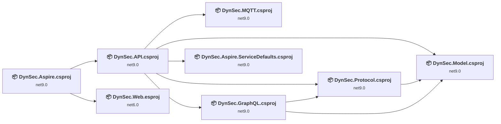
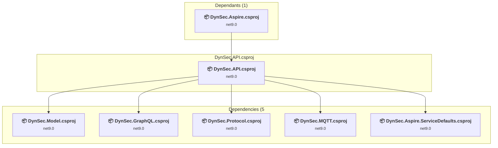
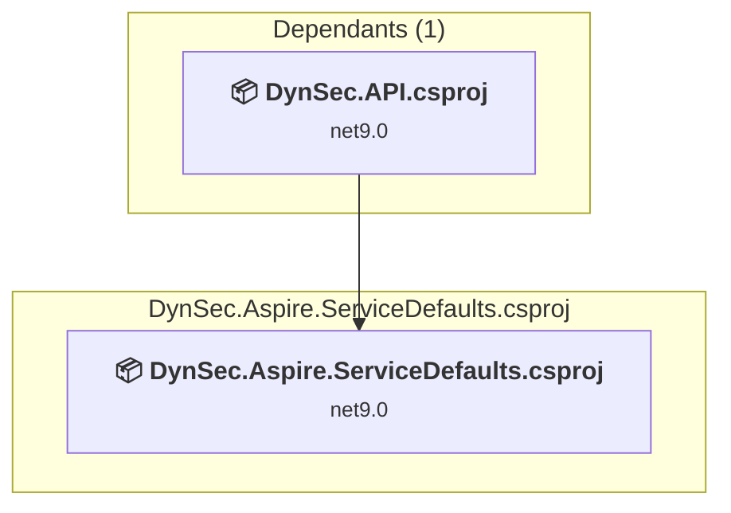
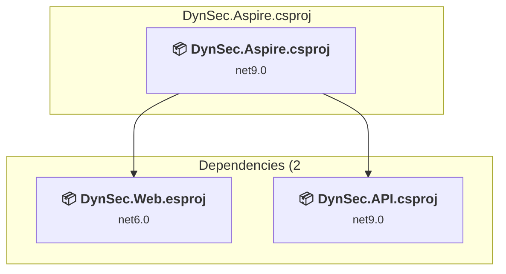
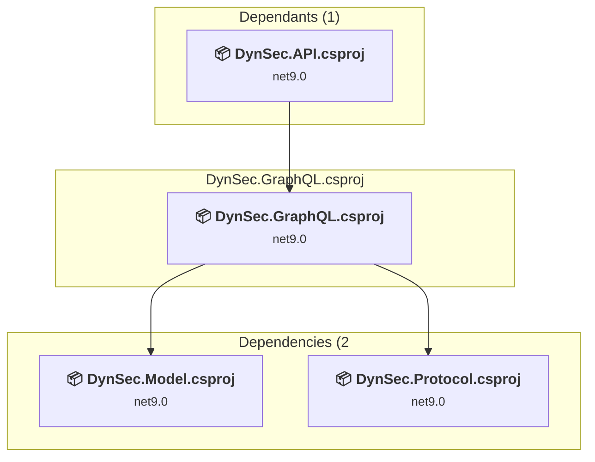
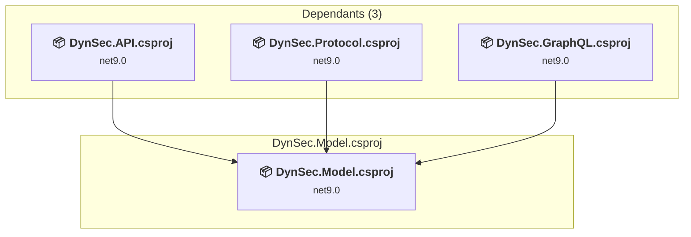
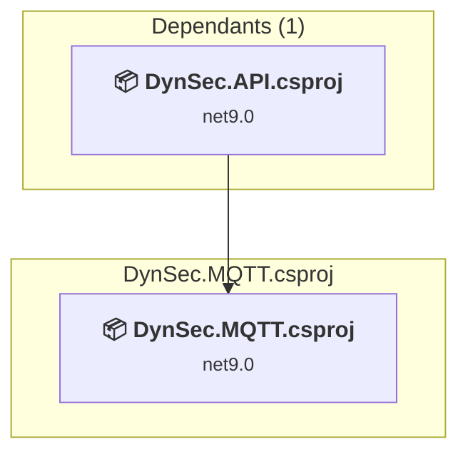
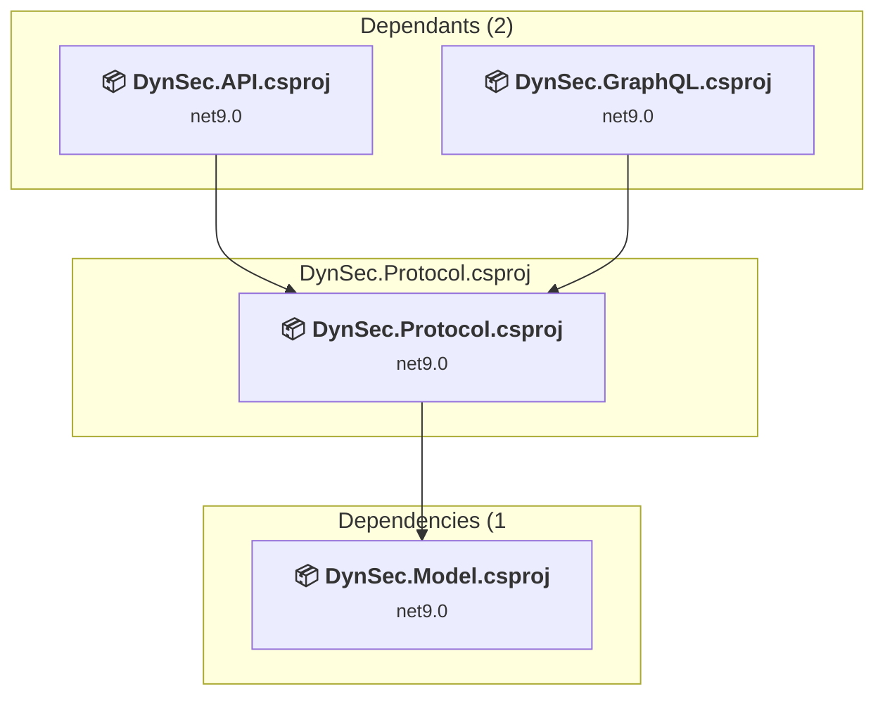
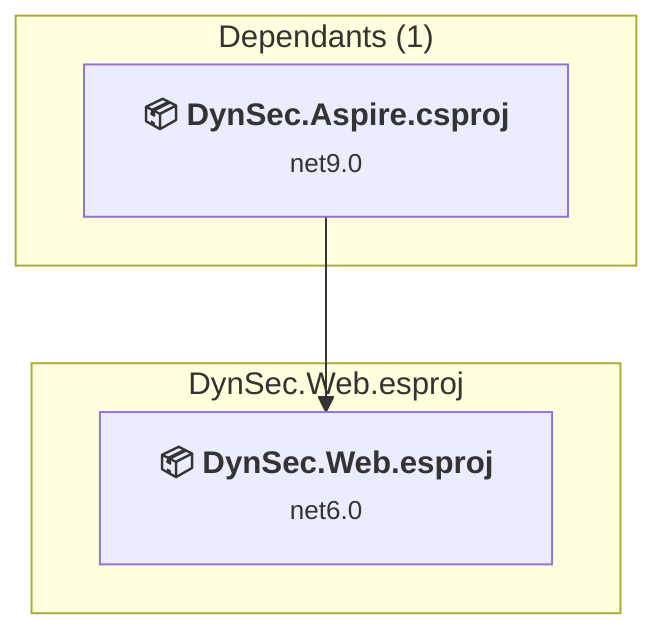

# Projects and dependencies analysis

This document provides a comprehensive overview of the projects and their dependencies in the context of upgrading to .NETCoreApp,Version=v10.0.

## Table of Contents

- [Executive Summary](#executive-Summary)
  - [Highlevel Metrics](#highlevel-metrics)
  - [Projects Compatibility](#projects-compatibility)
  - [Package Compatibility](#package-compatibility)
  - [API Compatibility](#api-compatibility)
- [Aggregate NuGet packages details](#aggregate-nuget-packages-details)
- [Top API Migration Challenges](#top-api-migration-challenges)
  - [Technologies and Features](#technologies-and-features)
  - [Most Frequent API Issues](#most-frequent-api-issues)
- [Projects Relationship Graph](#projects-relationship-graph)
- [Project Details](#project-details)

  - [DynSec.API\DynSec.API.csproj](#dynsecapidynsecapicsproj)
  - [DynSec.Aspire.ServiceDefaults\DynSec.Aspire.ServiceDefaults.csproj](#dynsecaspireservicedefaultsdynsecaspireservicedefaultscsproj)
  - [DynSec.Aspire\DynSec.Aspire.csproj](#dynsecaspiredynsecaspirecsproj)
  - [DynSec.GraphQL\DynSec.GraphQL.csproj](#dynsecgraphqldynsecgraphqlcsproj)
  - [DynSec.Model\DynSec.Model.csproj](#dynsecmodeldynsecmodelcsproj)
  - [DynSec.MQTT\DynSec.MQTT.csproj](#dynsecmqttdynsecmqttcsproj)
  - [DynSec.Protocol\DynSec.Protocol.csproj](#dynsecprotocoldynsecprotocolcsproj)
  - [DynSec.Web\DynSec.Web.esproj](#dynsecwebdynsecwebesproj)

## Executive Summary

### Highlevel Metrics

| Metric | Count | Status |
| :--- | :---: | :--- |
| Total Projects | 8 | All require upgrade |
| Total NuGet Packages | 23 | 11 need upgrade |
| Total Code Files | 98 |  |
| Total Code Files with Incidents | 10 |  |
| Total Lines of Code | 3639 |  |
| Total Number of Issues | 40 |  |
| Estimated LOC to modify | 19+ | at least 0.5% of codebase |

### Projects Compatibility

| Project | Target Framework | Difficulty | Package Issues | API Issues | Est. LOC Impact | Description |
| :--- | :---: | :---: | :---: | :---: | :---: | :--- |
| [DynSec.API\DynSec.API.csproj](#dynsecapidynsecapicsproj) | net9.0 | 🟢 Low | 2 | 16 | 16+ | AspNetCore, Sdk Style = True |
| [DynSec.Aspire.ServiceDefaults\DynSec.Aspire.ServiceDefaults.csproj](#dynsecaspireservicedefaultsdynsecaspireservicedefaultscsproj) | net9.0 | 🟢 Low | 5 | 0 |  | ClassLibrary, Sdk Style = True |
| [DynSec.Aspire\DynSec.Aspire.csproj](#dynsecaspiredynsecaspirecsproj) | net9.0 | 🟢 Low | 4 | 0 |  | DotNetCoreApp, Sdk Style = True |
| [DynSec.GraphQL\DynSec.GraphQL.csproj](#dynsecgraphqldynsecgraphqlcsproj) | net9.0 | 🟢 Low | 0 | 0 |  | ClassLibrary, Sdk Style = True |
| [DynSec.Model\DynSec.Model.csproj](#dynsecmodeldynsecmodelcsproj) | net9.0 | 🟢 Low | 0 | 0 |  | ClassLibrary, Sdk Style = True |
| [DynSec.MQTT\DynSec.MQTT.csproj](#dynsecmqttdynsecmqttcsproj) | net9.0 | 🟢 Low | 0 | 0 |  | ClassLibrary, Sdk Style = True |
| [DynSec.Protocol\DynSec.Protocol.csproj](#dynsecprotocoldynsecprotocolcsproj) | net9.0 | 🟢 Low | 2 | 3 | 3+ | ClassLibrary, Sdk Style = True |
| [DynSec.Web\DynSec.Web.esproj](#dynsecwebdynsecwebesproj) | net6.0 | 🟢 Low | 0 | 0 |  | DotNetCoreApp, Sdk Style = True |

### Package Compatibility

| Status | Count | Percentage |
| :--- | :---: | :---: |
| ✅ Compatible | 12 | 52.2% |
| ⚠️ Incompatible | 0 | 0.0% |
| 🔄 Upgrade Recommended | 11 | 47.8% |
| ***Total NuGet Packages*** | ***23*** | ***100%*** |

### API Compatibility

| Category | Count | Impact |
| :--- | :---: | :--- |
| 🔴 Binary Incompatible | 1 | High - Require code changes |
| 🟡 Source Incompatible | 18 | Medium - Needs re-compilation and potential conflicting API error fixing |
| 🔵 Behavioral change | 0 | Low - Behavioral changes that may require testing at runtime |
| ✅ Compatible | 3313 |  |
| ***Total APIs Analyzed*** | ***3332*** |  |

## Aggregate NuGet packages details

| Package | Current Version | Suggested Version | Projects | Description |
| :--- | :---: | :---: | :--- | :--- |
| Arshid.Aspire.ApiDocs.Extensions | 9.2.0.2 |  | [DynSec.Aspire.csproj](#dynsecaspiredynsecaspirecsproj) | ✅Compatible |
| Aspire.Hosting.AppHost | 9.3.0 | 13.4.0 | [DynSec.Aspire.csproj](#dynsecaspiredynsecaspirecsproj) | NuGet package upgrade is recommended |
| Aspire.Hosting.NodeJs | 9.3.0 | 9.5.2 | [DynSec.Aspire.csproj](#dynsecaspiredynsecaspirecsproj) | NuGet package upgrade is recommended |
| HotChocolate.AspNetCore | 15.1.5 |  | [DynSec.GraphQL.csproj](#dynsecgraphqldynsecgraphqlcsproj) | ✅Compatible |
| HotChocolate.Types.Analyzers | 15.1.5 |  | [DynSec.GraphQL.csproj](#dynsecgraphqldynsecgraphqlcsproj) | ✅Compatible |
| Microsoft.AspNetCore.Authentication.OpenIdConnect | 9.0.5 | 10.0.8 | [DynSec.API.csproj](#dynsecapidynsecapicsproj) | NuGet package upgrade is recommended |
| Microsoft.AspNetCore.OpenApi | 9.0.5 | 10.0.8 | [DynSec.API.csproj](#dynsecapidynsecapicsproj) | NuGet package upgrade is recommended |
| Microsoft.Extensions.DependencyInjection.Abstractions | 9.0.5 | 10.0.8 | [DynSec.Protocol.csproj](#dynsecprotocoldynsecprotocolcsproj) | NuGet package upgrade is recommended |
| Microsoft.Extensions.Http.Resilience | 9.5.0 | 10.6.0 | [DynSec.Aspire.ServiceDefaults.csproj](#dynsecaspireservicedefaultsdynsecaspireservicedefaultscsproj) | NuGet package upgrade is recommended |
| Microsoft.Extensions.Logging.Abstractions | 9.0.5 | 10.0.8 | [DynSec.Protocol.csproj](#dynsecprotocoldynsecprotocolcsproj) | NuGet package upgrade is recommended |
| Microsoft.Extensions.ServiceDiscovery | 9.3.0 | 10.6.0 | [DynSec.Aspire.ServiceDefaults.csproj](#dynsecaspireservicedefaultsdynsecaspireservicedefaultscsproj) | NuGet package upgrade is recommended |
| MQTTnet | 5.0.1.1416 |  | [DynSec.Protocol.csproj](#dynsecprotocoldynsecprotocolcsproj) | ✅Compatible |
| MQTTnet.AspNetCore | 5.0.1.1416 |  | [DynSec.MQTT.csproj](#dynsecmqttdynsecmqttcsproj) | ✅Compatible |
| MQTTnet.Extensions.Rpc | 5.0.1.1416 |  | [DynSec.Protocol.csproj](#dynsecprotocoldynsecprotocolcsproj) | ✅Compatible |
| OpenTelemetry.Exporter.OpenTelemetryProtocol | 1.12.0 | 1.15.3 | [DynSec.Aspire.ServiceDefaults.csproj](#dynsecaspireservicedefaultsdynsecaspireservicedefaultscsproj) | NuGet package contains security vulnerability |
| OpenTelemetry.Extensions.Hosting | 1.12.0 |  | [DynSec.Aspire.ServiceDefaults.csproj](#dynsecaspireservicedefaultsdynsecaspireservicedefaultscsproj) | ✅Compatible |
| OpenTelemetry.Instrumentation.AspNetCore | 1.12.0 | 1.15.2 | [DynSec.Aspire.ServiceDefaults.csproj](#dynsecaspireservicedefaultsdynsecaspireservicedefaultscsproj) | NuGet package upgrade is recommended |
| OpenTelemetry.Instrumentation.Http | 1.12.0 | 1.15.1 | [DynSec.Aspire.ServiceDefaults.csproj](#dynsecaspireservicedefaultsdynsecaspireservicedefaultscsproj) | NuGet package upgrade is recommended |
| OpenTelemetry.Instrumentation.Runtime | 1.12.0 |  | [DynSec.Aspire.ServiceDefaults.csproj](#dynsecaspireservicedefaultsdynsecaspireservicedefaultscsproj) | ✅Compatible |
| Scalar.AspNetCore | 2.4.7 |  | [DynSec.API.csproj](#dynsecapidynsecapicsproj) | ✅Compatible |
| Serilog | 4.3.0 |  | [DynSec.Protocol.csproj](#dynsecprotocoldynsecprotocolcsproj) | ✅Compatible |
| Serilog.AspNetCore | 9.0.0 |  | [DynSec.API.csproj](#dynsecapidynsecapicsproj) | ✅Compatible |
| Serilog.Sinks.OpenTelemetry | 4.2.0 |  | [DynSec.API.csproj](#dynsecapidynsecapicsproj) | ✅Compatible |

## Top API Migration Challenges

### Technologies and Features

| Technology | Issues | Percentage | Migration Path |
| :--- | :---: | :---: | :--- |
| IdentityModel & Claims-based Security | 1 | 5.3% | Windows Identity Foundation (WIF), SAML, and claims-based authentication APIs that have been replaced by modern identity libraries. WIF was the original identity framework for .NET Framework. Migrate to Microsoft.IdentityModel.* packages (modern identity stack). |

### Most Frequent API Issues

| API | Count | Percentage | Category |
| :--- | :---: | :---: | :--- |
| M:System.TimeSpan.FromSeconds(System.Int64) | 3 | 15.8% | Source Incompatible |
| P:Microsoft.AspNetCore.Authentication.OpenIdConnect.OpenIdConnectOptions.TokenValidationParameters | 2 | 10.5% | Source Incompatible |
| T:System.IdentityModel.Tokens.Jwt.JwtRegisteredClaimNames | 1 | 5.3% | Binary Incompatible |
| P:Microsoft.AspNetCore.Authentication.OpenIdConnect.OpenIdConnectOptions.MapInboundClaims | 1 | 5.3% | Source Incompatible |
| P:Microsoft.AspNetCore.Authentication.OpenIdConnect.OpenIdConnectOptions.GetClaimsFromUserInfoEndpoint | 1 | 5.3% | Source Incompatible |
| P:Microsoft.AspNetCore.Authentication.OpenIdConnect.OpenIdConnectOptions.UsePkce | 1 | 5.3% | Source Incompatible |
| P:Microsoft.AspNetCore.Authentication.OpenIdConnect.OpenIdConnectOptions.ResponseMode | 1 | 5.3% | Source Incompatible |
| P:Microsoft.AspNetCore.Authentication.OpenIdConnect.OpenIdConnectOptions.ResponseType | 1 | 5.3% | Source Incompatible |
| P:Microsoft.AspNetCore.Authentication.OpenIdConnect.OpenIdConnectOptions.SignOutScheme | 1 | 5.3% | Source Incompatible |
| P:Microsoft.AspNetCore.Authentication.OpenIdConnect.OpenIdConnectOptions.ClientSecret | 1 | 5.3% | Source Incompatible |
| P:Microsoft.AspNetCore.Authentication.OpenIdConnect.OpenIdConnectOptions.ClientId | 1 | 5.3% | Source Incompatible |
| P:Microsoft.AspNetCore.Authentication.OpenIdConnect.OpenIdConnectOptions.Authority | 1 | 5.3% | Source Incompatible |
| T:Microsoft.AspNetCore.Authentication.OpenIdConnect.OpenIdConnectDefaults | 1 | 5.3% | Source Incompatible |
| F:Microsoft.AspNetCore.Authentication.OpenIdConnect.OpenIdConnectDefaults.AuthenticationScheme | 1 | 5.3% | Source Incompatible |
| T:Microsoft.Extensions.DependencyInjection.OpenIdConnectExtensions | 1 | 5.3% | Source Incompatible |
| M:Microsoft.Extensions.DependencyInjection.OpenIdConnectExtensions.AddOpenIdConnect(Microsoft.AspNetCore.Authentication.AuthenticationBuilder,System.Action{Microsoft.AspNetCore.Authentication.OpenIdConnect.OpenIdConnectOptions}) | 1 | 5.3% | Source Incompatible |

## Projects Relationship Graph

Legend:
📦 SDK-style project
⚙️ Classic project

## Project Details

### DynSec.API\DynSec.API.csproj

#### Project Info

- **Current Target Framework:** net9.0
- **Proposed Target Framework:** net10.0
- **SDK-style**: True
- **Project Kind:** AspNetCore
- **Dependencies**: 5
- **Dependants**: 1
- **Number of Files**: 8
- **Number of Files with Incidents**: 2
- **Lines of Code**: 690
- **Estimated LOC to modify**: 16+ (at least 2.3% of the project)

#### Dependency Graph

Legend:
📦 SDK-style project
⚙️ Classic project

### API Compatibility

| Category | Count | Impact |
| :--- | :---: | :--- |
| 🔴 Binary Incompatible | 1 | High - Require code changes |
| 🟡 Source Incompatible | 15 | Medium - Needs re-compilation and potential conflicting API error fixing |
| 🔵 Behavioral change | 0 | Low - Behavioral changes that may require testing at runtime |
| ✅ Compatible | 655 |  |
| ***Total APIs Analyzed*** | ***671*** |  |

#### Project Technologies and Features

| Technology | Issues | Percentage | Migration Path |
| :--- | :---: | :---: | :--- |
| IdentityModel & Claims-based Security | 1 | 6.3% | Windows Identity Foundation (WIF), SAML, and claims-based authentication APIs that have been replaced by modern identity libraries. WIF was the original identity framework for .NET Framework. Migrate to Microsoft.IdentityModel.* packages (modern identity stack). |

### DynSec.Aspire.ServiceDefaults\DynSec.Aspire.ServiceDefaults.csproj

#### Project Info

- **Current Target Framework:** net9.0
- **Proposed Target Framework:** net10.0
- **SDK-style**: True
- **Project Kind:** ClassLibrary
- **Dependencies**: 0
- **Dependants**: 1
- **Number of Files**: 1
- **Number of Files with Incidents**: 1
- **Lines of Code**: 127
- **Estimated LOC to modify**: 0+ (at least 0.0% of the project)

#### Dependency Graph

Legend:
📦 SDK-style project
⚙️ Classic project

### API Compatibility

| Category | Count | Impact |
| :--- | :---: | :--- |
| 🔴 Binary Incompatible | 0 | High - Require code changes |
| 🟡 Source Incompatible | 0 | Medium - Needs re-compilation and potential conflicting API error fixing |
| 🔵 Behavioral change | 0 | Low - Behavioral changes that may require testing at runtime |
| ✅ Compatible | 115 |  |
| ***Total APIs Analyzed*** | ***115*** |  |

### DynSec.Aspire\DynSec.Aspire.csproj

#### Project Info

- **Current Target Framework:** net9.0
- **Proposed Target Framework:** net10.0
- **SDK-style**: True
- **Project Kind:** DotNetCoreApp
- **Dependencies**: 2
- **Dependants**: 0
- **Number of Files**: 1
- **Number of Files with Incidents**: 1
- **Lines of Code**: 21
- **Estimated LOC to modify**: 0+ (at least 0.0% of the project)

#### Dependency Graph

Legend:
📦 SDK-style project
⚙️ Classic project

### API Compatibility

| Category | Count | Impact |
| :--- | :---: | :--- |
| 🔴 Binary Incompatible | 0 | High - Require code changes |
| 🟡 Source Incompatible | 0 | Medium - Needs re-compilation and potential conflicting API error fixing |
| 🔵 Behavioral change | 0 | Low - Behavioral changes that may require testing at runtime |
| ✅ Compatible | 49 |  |
| ***Total APIs Analyzed*** | ***49*** |  |

### DynSec.GraphQL\DynSec.GraphQL.csproj

#### Project Info

- **Current Target Framework:** net9.0
- **Proposed Target Framework:** net10.0
- **SDK-style**: True
- **Project Kind:** ClassLibrary
- **Dependencies**: 2
- **Dependants**: 1
- **Number of Files**: 4
- **Number of Files with Incidents**: 1
- **Lines of Code**: 184
- **Estimated LOC to modify**: 0+ (at least 0.0% of the project)

#### Dependency Graph

Legend:
📦 SDK-style project
⚙️ Classic project

### API Compatibility

| Category | Count | Impact |
| :--- | :---: | :--- |
| 🔴 Binary Incompatible | 0 | High - Require code changes |
| 🟡 Source Incompatible | 0 | Medium - Needs re-compilation and potential conflicting API error fixing |
| 🔵 Behavioral change | 0 | Low - Behavioral changes that may require testing at runtime |
| ✅ Compatible | 155 |  |
| ***Total APIs Analyzed*** | ***155*** |  |

### DynSec.Model\DynSec.Model.csproj

#### Project Info

- **Current Target Framework:** net9.0
- **Proposed Target Framework:** net10.0
- **SDK-style**: True
- **Project Kind:** ClassLibrary
- **Dependencies**: 0
- **Dependants**: 3
- **Number of Files**: 64
- **Number of Files with Incidents**: 1
- **Lines of Code**: 1751
- **Estimated LOC to modify**: 0+ (at least 0.0% of the project)

#### Dependency Graph

Legend:
📦 SDK-style project
⚙️ Classic project

### API Compatibility

| Category | Count | Impact |
| :--- | :---: | :--- |
| 🔴 Binary Incompatible | 0 | High - Require code changes |
| 🟡 Source Incompatible | 0 | Medium - Needs re-compilation and potential conflicting API error fixing |
| 🔵 Behavioral change | 0 | Low - Behavioral changes that may require testing at runtime |
| ✅ Compatible | 1707 |  |
| ***Total APIs Analyzed*** | ***1707*** |  |

### DynSec.MQTT\DynSec.MQTT.csproj

#### Project Info

- **Current Target Framework:** net9.0
- **Proposed Target Framework:** net10.0
- **SDK-style**: True
- **Project Kind:** ClassLibrary
- **Dependencies**: 0
- **Dependants**: 1
- **Number of Files**: 2
- **Number of Files with Incidents**: 1
- **Lines of Code**: 76
- **Estimated LOC to modify**: 0+ (at least 0.0% of the project)

#### Dependency Graph

Legend:
📦 SDK-style project
⚙️ Classic project

### API Compatibility

| Category | Count | Impact |
| :--- | :---: | :--- |
| 🔴 Binary Incompatible | 0 | High - Require code changes |
| 🟡 Source Incompatible | 0 | Medium - Needs re-compilation and potential conflicting API error fixing |
| 🔵 Behavioral change | 0 | Low - Behavioral changes that may require testing at runtime |
| ✅ Compatible | 99 |  |
| ***Total APIs Analyzed*** | ***99*** |  |

### DynSec.Protocol\DynSec.Protocol.csproj

#### Project Info

- **Current Target Framework:** net9.0
- **Proposed Target Framework:** net10.0
- **SDK-style**: True
- **Project Kind:** ClassLibrary
- **Dependencies**: 1
- **Dependants**: 2
- **Number of Files**: 20
- **Number of Files with Incidents**: 2
- **Lines of Code**: 790
- **Estimated LOC to modify**: 3+ (at least 0.4% of the project)

#### Dependency Graph

Legend:
📦 SDK-style project
⚙️ Classic project

### API Compatibility

| Category | Count | Impact |
| :--- | :---: | :--- |
| 🔴 Binary Incompatible | 0 | High - Require code changes |
| 🟡 Source Incompatible | 3 | Medium - Needs re-compilation and potential conflicting API error fixing |
| 🔵 Behavioral change | 0 | Low - Behavioral changes that may require testing at runtime |
| ✅ Compatible | 533 |  |
| ***Total APIs Analyzed*** | ***536*** |  |

### DynSec.Web\DynSec.Web.esproj

#### Project Info

- **Current Target Framework:** net6.0
- **Proposed Target Framework:** net10.0
- **SDK-style**: True
- **Project Kind:** DotNetCoreApp
- **Dependencies**: 0
- **Dependants**: 1
- **Number of Files**: 0
- **Number of Files with Incidents**: 1
- **Lines of Code**: 0
- **Estimated LOC to modify**: 0+ (at least 0.0% of the project)

#### Dependency Graph

Legend:
📦 SDK-style project
⚙️ Classic project

### API Compatibility

| Category | Count | Impact |
| :--- | :---: | :--- |
| 🔴 Binary Incompatible | 0 | High - Require code changes |
| 🟡 Source Incompatible | 0 | Medium - Needs re-compilation and potential conflicting API error fixing |
| 🔵 Behavioral change | 0 | Low - Behavioral changes that may require testing at runtime |
| ✅ Compatible | 0 |  |
| ***Total APIs Analyzed*** | ***0*** |  |

